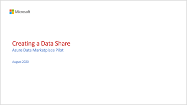

# Create a Data Share in your Data Share Account

To create Azure Marketplace Offers in the Partner Center portal, it is important to have a firm grasp of creating Data Shares within your Data Share service. This video will walk you through creating Data Shares that are ready to sell. 

Watch the following video to see how to create a Data Share consumers may subscribe to via the Azure Data Marketplace.

