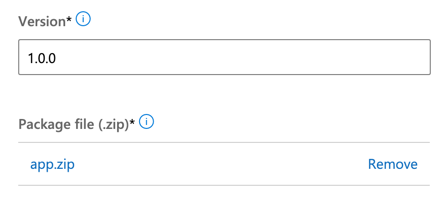

# Creating a Partner Center Plan's Technical Configuration

Watch this video to see how to properly configure an Offer's Plan in the Partner Center portal. The video shows how to configure a Plan's technical configuration. The instructions here are unique to data offers in the Azure Marketplace.

Each Plan for your Offer in Partner Center must meet certain technical criteria.

1. Navigate to your Plan's Technical Configuration tab
1. TODO: #3 Add instruction for `customer-allowed-actions.txt`.
1. Make the app.zip file on your hard drive.
1. Upload the `app.zip` 'Package file' as shown below. Do this for every Plan created for this Offer. This file contains the files neccessary to create the artifacts in the customer's account.

---

