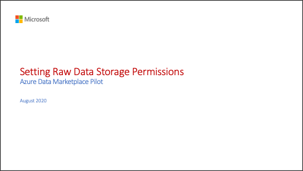

# Setting Data Share permissions on the raw data sources

This video shows how to apply the appropriate permissions to your raw data Storage accounts so the Data Share service can read from it and assemble Data Shares.

Pause at any time to work along with the video.

