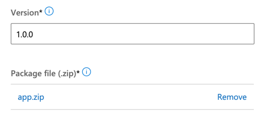

# Creating the ZIP file to include with every Plan in Partner Center

The files in this directory must be zipped up into a *.zip package so they may deployed with every Plan within your Offers as defined in Partner Center.

The compressed file with these resources in it is typically called 'app.zip'.

The files from this folder that go into the app.zip file exclude this README.md.

The following instructions assume you are not going to clone the repository.

1. Download the contents of this repository as a ZIP file from [this location](https://github.com/Azure/commercial-marketplace-data-offers/archive/main.zip).
1. On your machine, unzip the downloaded file. This will create a new folder on your machine.
1. Navigate into the folder `main/install/subscriber`.
1. Select the following files and create a ZIP file containing only these files.
    * nestedtemplates folder
    * createUiDefinition.json
    * mainTemplate.json
    * viewDefinition.json
1. Name the ZIP file something meaningful like `app.zip`.
1. When creating an Plan within your offer Offer in the Partner Center portal, each Plan requires a ZIP file to uploaded on the `Plan overview > Technical configuration` screen.
1. Upload the ZIP file you created on this screen for the 'Package file' as shown below. Do this for every Plan created for this Offer.

